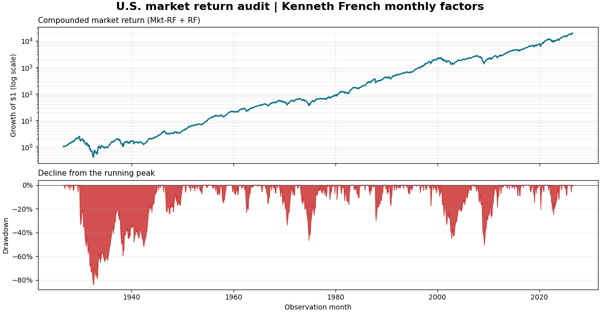

# Return Series Auditor

`return-series-auditor` is a small Python CLI that exposes data-quality problems and statistical fragility in dated investment returns or equity curves.

```console
$ return-audit examples/clean_returns.csv
RETURN SERIES AUDIT
Source: examples/clean_returns.csv
Input: return
Result: PASS

METRICS
Observations: 60
Start date: 2020-01-01
End date: 2024-12-01
Inferred frequency: monthly
Periods per year: 12
Total compounded return: 48.42%
...
```

The report gives each check an explicit `PASS`, `INFO`, `WARN`, or `FAIL`; it does not hide the results behind a combined score. The files in [`examples/`](examples) are synthetic and are not records of real investment performance.

## Real-world demonstration

[](notebooks/real_market_returns_audit.ipynb)

The executed [real-market audit notebook](notebooks/real_market_returns_audit.ipynb) downloads the monthly U.S. market factors directly from the official [Kenneth French Data Library](https://mba.tuck.dartmouth.edu/pages/faculty/ken.french/data_library.html), reconstructs the market return as `Mkt-RF + RF`, and passes the resulting decimal return series through the package's public audit interface. The notebook records retrieval provenance and a content hash, visualizes growth and drawdown, tests best-month dependence, and demonstrates detection with a deliberately corrupted temporary copy; no raw external dataset is committed.

```bash
python -m pip install -e ".[notebook]"
python -m nbconvert --to notebook --execute --inplace notebooks/real_market_returns_audit.ipynb
```

## Installation

Python 3.12 or later is required. From a checkout:

```bash
python -m pip install -e .
```

The package has no runtime dependencies outside the Python standard library. Installation provides the `return-audit` command.

## Usage

```bash
return-audit examples/clean_returns.csv
return-audit examples/problematic_returns.csv --format markdown
return-audit data.csv --format json
return-audit data.csv --strict
return-audit data.csv --periods-per-year 252
```

The default format is plain terminal text. `--format json` emits a stable, machine-readable document with schema version `1.0`; `--format markdown` emits tables suitable for a report or CI summary. The same input and options produce the same ordered findings and values.

### Accepted CSV formats

Use an ISO 8601 date and exactly one value column:

```csv
date,return
2025-01-02,0.0042
```

or:

```csv
date,equity
2025-01-02,100000
```

Returns are decimals: `0.01` means 1%. Column names are case-insensitive and surrounding header whitespace is ignored. Equity is sorted by date after order and duplicate checks, then converted to returns with `current_equity / previous_equity - 1`. Invalid rows and later duplicate occurrences are excluded from calculations; the report always discloses those exclusions.

## Metrics

- **Observations** is the number of usable periodic returns. An equity input with _n_ usable levels produces _n - 1_ returns.
- **Start and end dates** bound the return observations used for metrics.
- **Inferred frequency** uses the median calendar-day spacing: up to 3 days is daily, up to 10 is weekly, and anything longer is monthly. One or zero dates is reported as unknown.
- **Total compounded return** is `product(1 + return) - 1`.
- **CAGR** is `(1 + total_return) ** (periods_per_year / observations) - 1`; it is unavailable when terminal wealth is not positive or frequency is unknown.
- **Annualized volatility** is sample standard deviation multiplied by the square root of periods per year.
- **Sharpe ratio** is the arithmetic mean return divided by sample standard deviation, annualized by the square root of periods per year. The default periodic risk-free rate is zero.
- **Sortino ratio** replaces standard deviation with the root mean square of `min(return, 0)`, then annualizes in the same way.
- **Maximum drawdown** is the largest peak-to-trough loss on a wealth index starting at 1.0.
- **Maximum drawdown duration** is the longest consecutive number of return observations below the running peak.
- **Current drawdown** is the final wealth level relative to its running peak.
- **Best and worst periods** are the largest and smallest dated returns.
- **Results without the best 1, 3, and 5 periods** re-compound the series after removing those returns; ties are resolved by original chronological position.
- **Best-three positive contribution** is the sum of the three largest positive returns divided by the sum of all positive returns.
- **Maximum-drawdown recovery** says whether wealth returned to the peak that preceded the deepest drawdown after its trough.

Daily, weekly, and monthly data use annualization factors of 252, 52, and 12. `--periods-per-year` overrides that factor but does not change the reported inferred frequency. Ratios are unavailable when their denominator is effectively zero.

## Audit checks

- **Missing and unparseable values:** missing dates/values, invalid ISO dates, and invalid numeric text fail the audit.
- **Duplicate dates:** duplicates fail the audit; the first occurrence is retained for metrics.
- **Date order:** any backward movement in file order fails the audit; metrics still use chronological order.
- **Non-finite values:** `NaN` and positive or negative infinity fail the audit and are excluded.
- **Impossible returns:** a return at or below -100% fails the audit.
- **Non-positive equity:** zero or negative equity fails the audit and is excluded from conversion.
- **Suspicious gaps:** inferred daily, weekly, and monthly series warn for gaps longer than 7, 21, and 62 calendar days respectively.
- **Track-record length:** no usable returns fails the audit; otherwise, fewer than one inferred year of returns, with an absolute floor of 12 observations, produces a warning.
- **Zero or near-zero variance:** annualized volatility no greater than `1e-8` (0.000001%) produces a warning because risk-adjusted ratios are unstable.
- **Best-period dependence:** each best-1, best-3, and best-5 check warns when removing those periods makes a positive compounded result non-positive or reduces it by at least 50% relative to the original result.
- **Positive-return concentration:** the best three periods contributing at least 50% of all positive arithmetic returns produces a warning.
- **Drawdown recovery:** an unrecovered maximum drawdown produces a warning.

Warnings and failures include the observed count, rows, dates, threshold, or calculated result that caused the classification. `INFO` means a check is descriptive or cannot be meaningfully classified with the available series.

## Exit codes and CI

| Code | Meaning |
|---:|---|
| `0` | Audit completed without failures. |
| `1` | One or more failures were found. With `--strict`, warnings also produce this code. |
| `2` | Invalid command usage, unreadable input, or an unsupported CSV header. |

For CI, use `--strict` when statistical warnings should block a build and JSON when downstream tooling consumes the result:

```bash
return-audit data.csv --strict --format json > audit.json
```

The repository workflow installs the package and runs the complete `unittest` suite on Python 3.12, 3.13, and 3.14.

## Methodology, assumptions, and limitations

Calculations treat observations as one unweighted return stream, assume returns use the same periodic convention, use a zero risk-free rate, and do not adjust for cash flows, fees, taxes, inflation, serial correlation, or non-trading calendars. Frequency and gap detection are deliberately simple, deterministic heuristics; an explicit annualization override is appropriate for unusual schedules. Invalid data can make displayed metrics economically unreliable even when a value can still be calculated, so findings should be reviewed before metrics.

This tool audits the supplied numbers. It does **not** detect look-ahead bias, survivorship bias, data snooping, hidden leverage, incorrect fills, or fabricated inputs, and it does not prove that a strategy is valid or investable. Historical statistics do not predict future results.

This project is for educational and data-quality review purposes only. It is not investment advice or a recommendation to buy, sell, or hold any asset.

## Development

```bash
python -m unittest discover -s tests -v
return-audit examples/clean_returns.csv
return-audit examples/problematic_returns.csv --format markdown
```

Created by **Carlos Barredo Lago** and released under the [MIT License](LICENSE).
